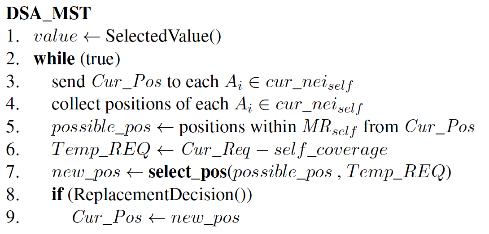
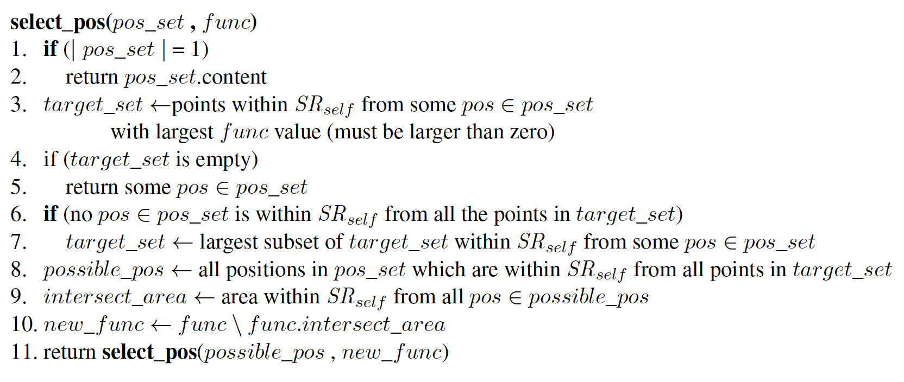
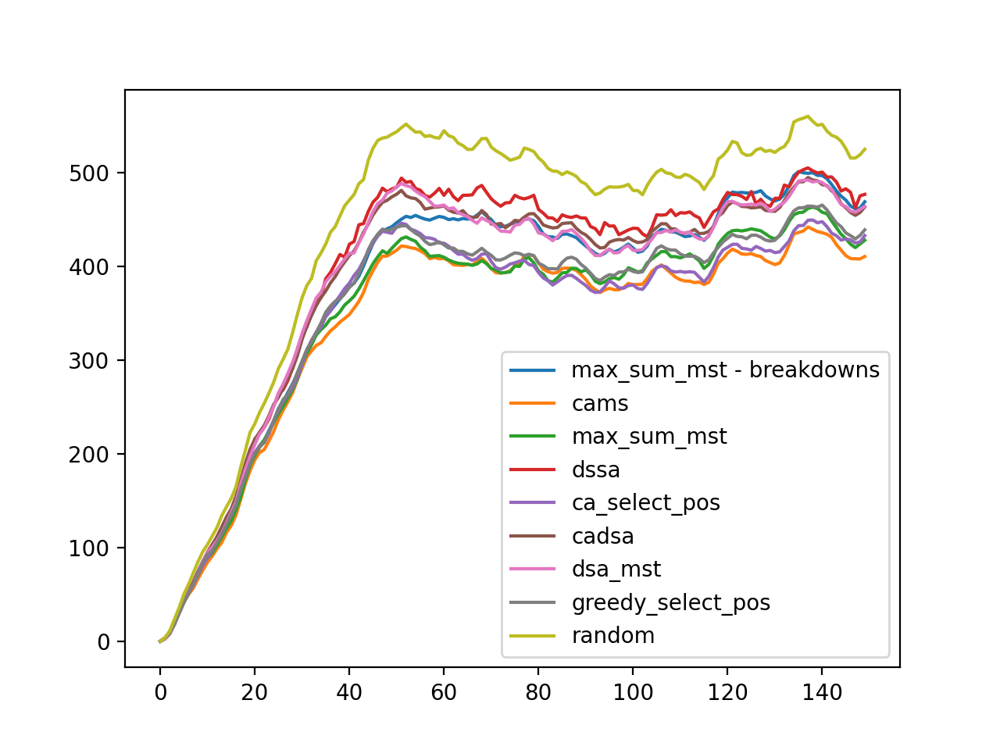
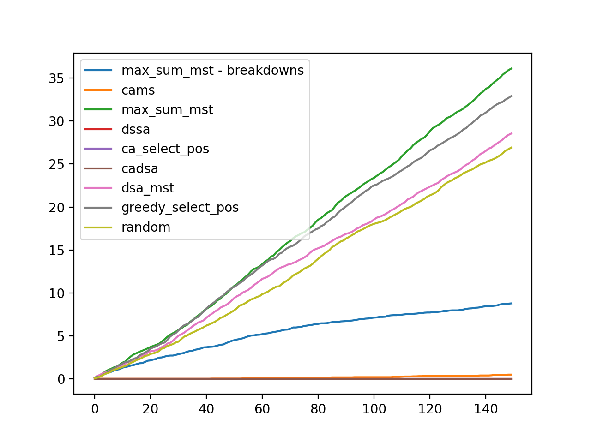

# DCOP_MST Simulator (version 4)

## Algorithms

### Random

Each robot picks its future position in a random manner.

### Greedy

A robot calculates total req for each position in its domain. Then it picks position that has the most req. If all positions are zero - it picks random.

### DSA_MST

Pseudocode:

`select_pos` function:

### CADSA

After choosing DSA_MST next positions agents send the positions to their neighbours. The receiver will not go to a new position if it contradicts with next or (!) current positions of other agents.

### SelectPos

Next position of an agent is chosen greedily by `select-pos` function.

### CA-SelectPos

After choosing SelectPos next positions agents send the positions to their neighbours. The receiver will not go to a new position if it contradicts with next or (!) current positions of other agents.

### DSSA

From paper "DSSA+: Distributed Collision Avoidance Algorithm in an Environment where Both Course and Speed Changes are Allowed", K. Hirayama et al., 2019.

The flowchart of DSSA:

### Max-sum_MST

We apply Max-sum to DCOP_MST by adjusting the framework suggested in [*] as follows:

1. Select a random assignment.

2. Generate a factor graph according to the current assignment where each sensor is
a variable-node and each target is a function-node. Variable-node i is connected
by an edge to a function-node if and only if the distance between them is less
than or equal to the sum of $MR_i + SR_i$, i.e., the sensor can cover the target after
a single move.

3. The agents execute the Max-sum algorithm for a predefined number of iterations.

4. The sensors move to the best position (value assignment) as calculated by the
algorithm.

5. A new factor graph is generated according to the new assignment selection and
the process repeats itself.

[*] R. Stranders et al. “Decentralised Coordination of Mobile Sensors Using the
Max-Sum Algorithm”. In: Proceedings of the International Joint Conference on
Artificial Intelligence. 2009, pp. 299–304.

### Max-sum_MST with breakdowns

Acts the same as Max-sum_MST but after calculations the algorithm checks if the robot is "broken". 
If yes the robot stays on the same position. 
It will "brake" if it will collide with other robot.

### CAMS

Acts the same as Max-sum_MST plus some additions. 
Positions themselves are also a part of the graph, and they represented as function nodes.
They will send a little weight to assignment on their position and 0 on others.
If the assignment includes several robots it will return minus infinity.

## Results

### Coverage Graph

Remained coverage during the run.
Averaged over 50 problems.

### Collisions Graph

Cumulative sum of collisions during the run.
Averaged over 50 problems.

## Credits

- [github | DCOP_MST Simulator (Version 3)](https://github.com/Arseni1919/dcop_simulator_3)
- [github | MAPF Simulator](https://github.com/Arseni1919/MAPF_Simulator)
- [github | Multi-Agent System Simulator](https://github.com/Arseni1919/mas_simulator_1)