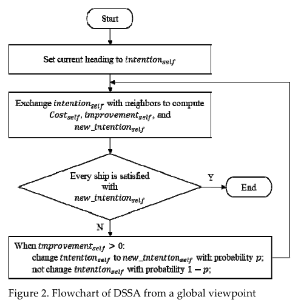

# DCOP_MST Simulator (version 4)

## Algorithms

### Random

Each robot picks its future position in a random manner.

### Greedy

A robot calculates total req for each position in its domain. Then it picks position that has the most req. If all positions are zero - it picks random.

### DSA_MST

Pseudocode:

`select_pos` function:

### CADSA

After choosing DSA_MST next positions agents send the positions to their neighbours. The receiver will not go to a new position if it contradicts with next or (!) current positions of other agents.

### SelectPos

Next position of an agent is chosen greedily by `select-pos` function.

### CA-SelectPos

After choosing SelectPos next positions agents send the positions to their neighbours. The receiver will not go to a new position if it contradicts with next or (!) current positions of other agents.

### DSSA

From paper "DSSA+: Distributed Collision Avoidance Algorithm in an Environment where Both Course and Speed Changes are Allowed", K. Hirayama et al., 2019.

The flowchart of DSSA:

### Max-sum_MST

### Max-sum_MST with breakdowns

### CAMS

## Results

## Credits

- [github | DCOP_MST Simulator (Version 3)](https://github.com/Arseni1919/dcop_simulator_3)
- [github | MAPF Simulator](https://github.com/Arseni1919/MAPF_Simulator)
- [github | Multi-Agent System Simulator](https://github.com/Arseni1919/mas_simulator_1)